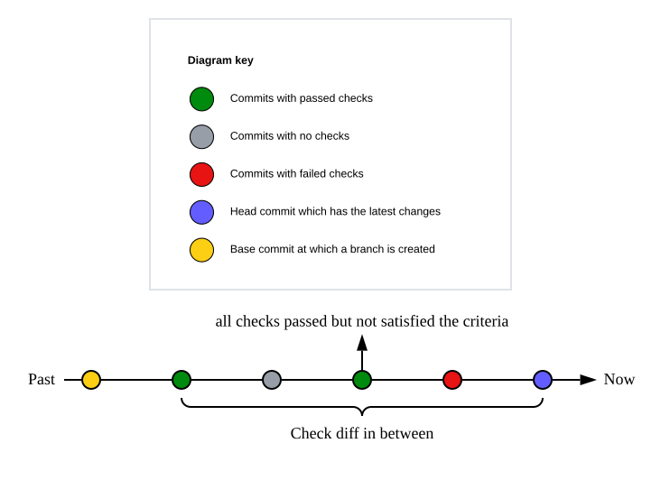

# Diff and Status Checker for Pull Request

A GitHub action to check if there are any differences in the pull request since last passed checks.



## Motivation

When you are waiting for your pull request to be approved and merged, some commit from other people or teams that doesn't change your source code triggers some of the GitHub action workflows to run again. It may take a while to complete the workflows. Then you have to get another approval before merge. This issue becomes extremely painful when you work on a big project or a mono repo that has hundreds of projects. This GitHub action is here to solve this pain point for you. It will look for all changes in the `designated paths` from the most recent commit that passed only the `specified checks` you care about, e.g. unit tests, to the latest commit in a pull request. Then you can make a decision what to do if there are changes or not.

## Scope

This action is only applicable to `pull_request` event:

## Usage

### Inputs

```yaml
# Use an appropriate version
- uses: shiyouping/diff-and-status-checker@0.0.3
  with:
    # Optional. Default: ${{ github.token }}
    # The GitHub token used to create an authenticated client.
    token:

    # Optional.
    # A list of filters delimited by comma or in a new line. If specified,
    # only changed files in the designated paths will be checked; otherwise
    # all will be checked. See https://github.com/micromatch/picomatch
    # for how to write glob patterns for your paths.
    filters:

    # Optional.
    # A list of GitHub workflow job names delimited by comma or in a new line.
    # If specified, only those jobs in the list will be checked; otherwise all
    # will be checked. Only one of `includeJobs` and `excludeJobs` is allowed.
    #
    # Note that if a commit has no workflow jobs specified in this list, it will
    # be seen as `FAILED`, and the action will continue to check its previous commits.
    includeJobs:

    # Optional.
    # A list of GitHub workflow job names delimited by comma or in a new line. If
    # specified, those jobs in the list will be skipped; otherwise none will be
    # skipped. Only one of `includeJobs` and `excludeJobs` is allowed.
    #
    # Note that if a commit's workflow jobs are all covered by this list, it will be
    # seen as `PASSED`, and the action will use the SHA of this commit to calculate
    # the Git difference.
    excludeJobs:
```

### Outputs

| Name    | Description                                            | Example           |
| ------- | ------------------------------------------------------ | ----------------- |
| hasDiff | Indicate if there are differences for the given inputs | "true" or "false" |

## Algorithm

If there are no changed files included in the `filters` for a pull request, the output is `false`; otherwise this action will detect changed files based on the incremental changes since the last commit that passes the checks that are included in `includeJobs` but not in `excludeJobs`.

This action will retrieve all the commits that belong to a pull request, and check every single commit starting from the most recent one in reverse order. If the commit has jobs included in `includeJobs` but not in `excludeJobs`, and the conclusion of each job is one of `neutral`, `success` and `skipped`, then this action will mark the current commit as `base` commit, and use `git diff --name-only ${base} ${head}` to calculate the differences in between. If the differences are included in the `filters`, then this action will return `true`, otherwise `false`.

## Note

- When used with [actions/checkout](https://github.com/marketplace/actions/checkout), an appropriate `fetch-depth` number must be provided; otherwise the diff may not be detected if the most recent commit that passed the checks is too far away from `HEAD`.
- `filters` supports glob patterns for the paths. See [Picomatch](https://github.com/micromatch/picomatch) for more details.
- Only one of `includeJobs` and `excludeJobs` is allowed.

## Example

```yaml
steps:
  - name: Checkout
    id: checkout
    uses: actions/checkout@v4
    with:
      fetch-depth: 50

  - name: Check diff and status
    id: check-diff-and-status
    uses: shiyouping/diff-and-status-checker@v0.0.3
    with:
      filters: |
        src/**
        test/**
      includeJobs: |
        Lint
        Build
        Test

  - name: Run unit tests
    if: ${{steps.check-diff-and-status.outputs.hasDiff == 'true'}}
    run: echo "Running unit tests"

  - name: Deploy to production
    if: ${{steps.check-diff-and-status.outputs.hasDiff == 'true'}}
    run: echo "Deploying to production"
```
